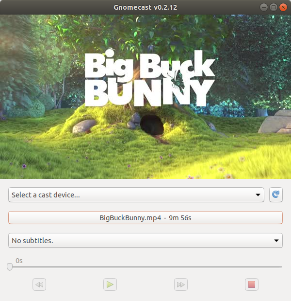

GnomeCast
=========

This is a native Linux GUI for casting local files to ChromeCast devices.  It supports:

- Realtime transcoding (only when needed)
- Subtitles (embedded and external SRT files)
- Fast scrubbing (waiting 20s for buffering to skip 30s ahead is wrong!)

Install
-------
Please run:

```
pip3 install gnomecast
```

Run
---

```
python3 -m gnomecast
```

If you see:
```
AttributeError: module 'html5lib.treebuilders' has no attribute '_base'
```

This is a known bug in `html5lib` (used by `pycaptions`).  Run this to fix it:
```
# pip3 install --upgrade html5lib==1.0b8
```

Thanks To...
------------

- https://github.com/balloob/pychromecast
- https://github.com/pbs/pycaption
- https://www.ffmpeg.org/

Please report bugs!
